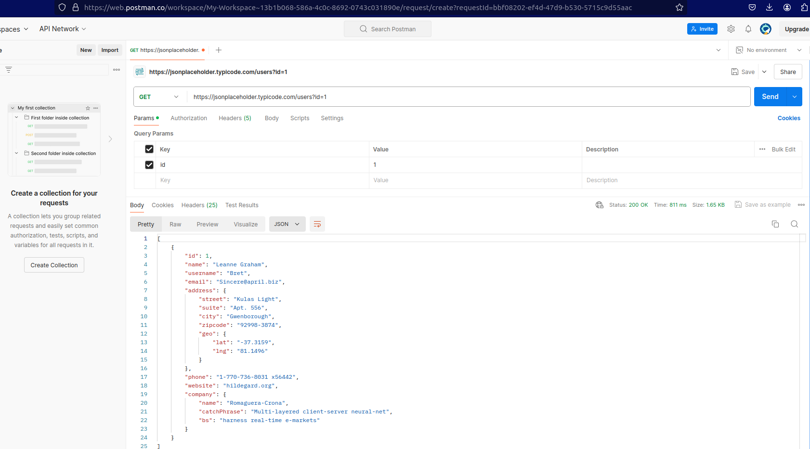

HERE YOU CAN FIND THE SCREENSHOT ABOUT POSTMAN

# Communication between Backend and Frontend
Communication between the backend and frontend of a web application typically involves sending and receiving data over the internet using HTTP (Hypertext Transfer Protocol). Here is an overview of how this communication works:

## Key components
1. **Frontend:** The client-side part of the application, usually running in the user's web browser. It includes HTML, CSS and Javascript.
2. **Backend:** The server-side part of the application that handles business logic, database interactions, and processing. It often involves a web server and a database.

## Key points
1. **HTTP/HTTPS Requests**

    *Requests and Responses*: The frontend (usually a web browser or a client-side application) makes HTTP or HTTPS requests to the backend server. These requests can be of various types (GET, POST, PUT, DELETE, etc.) and typically include URL endpoints, headers, and sometimes a payload (data).
    *Endpoints*: The backend exposes endpoints (URLs) that the frontend can request. These endpoints are usually defined in a RESTful manner (e.g., /api/users, /api/orders).

2. **APIs**

    *REST API*: Representational State Transfer (REST) is a common architectural style for designing networked applications. In RESTful services, data is typically exchanged in the form of JSON (JavaScript Object Notation) or XML.
    *GraphQL*: An alternative to REST, GraphQL allows clients to request exactly the data they need, improving efficiency and flexibility.

3. **WebSockets**

    *Real-Time Communication*: WebSockets provide a full-duplex communication channel over a single, long-lived connection. This is useful for real-time applications like chat apps, live notifications, and online gaming.
    *Server-Sent Events (SSE)*: Another method for real-time updates, where the server can push updates to the client over a single HTTP connection.

4. **AJAX**

    *Asynchronous Requests*: AJAX (Asynchronous JavaScript and XML) allows web pages to be updated asynchronously by exchanging small amounts of data with the server behind the scenes. This enables parts of a web page to be updated without refreshing the whole page.

5. **Fetch API**

    *Modern JavaScript API*: The Fetch API is a modern alternative to AJAX for making asynchronous requests. It uses Promises, making the code more readable and manageable.

6. **Web APIs and Services**

    *SOAP*: Simple Object Access Protocol is an older protocol for exchanging structured information in web services, using XML.
    *Third-Party APIs*: Frontend applications often communicate with third-party services (like Google Maps, payment gateways, social media platforms) through their provided APIs.

7. **Security**

    *Authentication*: Mechanisms like OAuth, JWT (JSON Web Tokens), and session-based authentication ensure that only authorized users can access certain endpoints.
    *Encryption*: HTTPS ensures that data transmitted between frontend and backend is encrypted, protecting against eavesdropping and man-in-the-middle attacks.

8. **State Management**

    *Session Storage*: Data related to the user’s session can be stored on the server, typically using session cookies.
    *Local Storage*: The frontend can use local storage or indexedDB for caching data to reduce the number of server requests.

**Example Workflow**

    -User Action: A user clicks a button on the frontend.
    -Frontend Request: The frontend makes an AJAX or Fetch API request to a backend endpoint (e.g., /api/data).
    -Backend Processing: The backend receives the request, processes it (e.g., querying a database), and prepares a response.
    -Backend Response: The backend sends a response (usually JSON) back to the frontend.
    -Frontend Update: The frontend receives the response and updates the UI accordingly (e.g., displaying the retrieved data).

**Technologies Involved**

    -Frontend: HTML, CSS, JavaScript, React, Angular, Vue.js, etc.
    -Backend: Node.js, Django, Ruby on Rails, Spring Boot, Express.js, etc.
    -Protocols: HTTP/HTTPS, WebSockets, GraphQL, REST.

Understanding these communication mechanisms is crucial for developing robust and efficient web applications.